# 医院排队叫号分诊管理系统

#### 介绍
医院排队叫号分诊管理系统，包含6个端：管理端、分诊端、医生叫号端、科室大屏端、诊室小屏端、自助签到端。

#### 软件架构
使用C#语言基于.NET平台Winform架构开发，支持SQLite、SQLServer等数据库以及各种WebService、WebAPI对接，支持FastReport报表模板自定义打印模板。

#### 功能说明

| 客户端端 | 功能说明 |
| :-- | :-- |
| 管理端 | 管理系统用户、角色、科室、诊室、医生等 |
| 分诊端 | 预约、扫码枪扫码、病人录入、就诊分诊（排队、重排、复诊、签到等）等|
| 医生叫号端 | 医生登录、设置科室/诊室、病人列表、刷新、呼叫、重呼、等待、停诊、接诊等 |
| 科室大屏端 | 显示当前科室下所有诊室、医生、就诊患者队列、实时刷新列表、实时显示叫号、语音播报、自启动 |
| 诊室小屏端 | 显示当前诊室信息、诊室坐诊医生信息、就诊患者队列、实时刷新列表、实时显示叫号、语音播报、自启动 |
| 自助签到端 | 首页菜单、扫码（条形码/二维码）、刷卡（身份证、就诊卡）、输入号码（挂号号、门诊号、住院号、身份证号等医疗号码）、查询预约/排队信息、签到、打印小票等 |

##### 管理端

- 用户管理
- 角色管理
- 科室管理
- 诊室管理
- 医生管理

##### 分诊端

- 预约
- 扫码枪扫码
- 病人录入
- 就诊分诊（排队、重排、复诊、签到等）

##### 医生叫号端

- 医生登录
- 设置科室/诊室
- 病人列表
- 刷新
- 呼叫
- 重呼
- 等待
- 停诊
- 接诊

##### 科室大屏端

- 科室下所有诊室
- 科室下所有医生
- 就诊患者队列
- 实时刷新列表
- 实时显示叫号
- 语音播报
- 自启动

##### 诊室小屏端

- 显示当前诊室信息
- 诊室坐诊医生信息
- 就诊患者队列
- 实时刷新列表
- 实时显示叫号
- 语音播报
- 自启动

##### 自助签到端

- 首页菜单
- 扫码（条形码/二维码）
- 刷卡（身份证、就诊卡）
- 输入号码（挂号号、门诊号、住院号、身份证号等医疗号码）
- 查询预约/排队信息
- 签到
- 打印小票

#### 安装教程

1. 下载源码
2. 打开Visual Studio 2019，导入源码
3. 打开数据库文件，导入到SQLite或SQLServer数据库
4. 修改数据库连接配置文件，根据实际情况修改数据库连接信息
5. 编译并运行

#### 使用说明

#### 效果展示

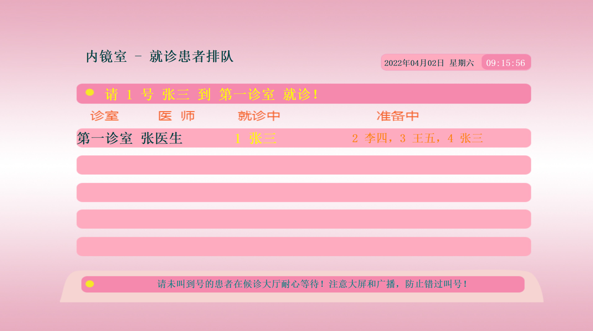

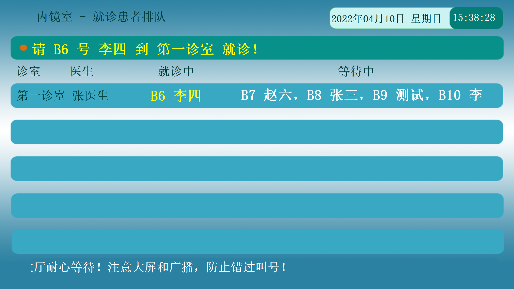

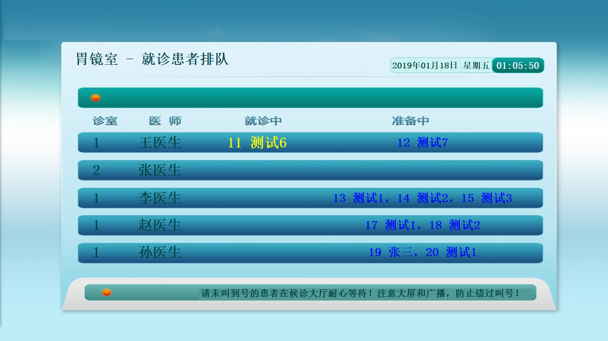

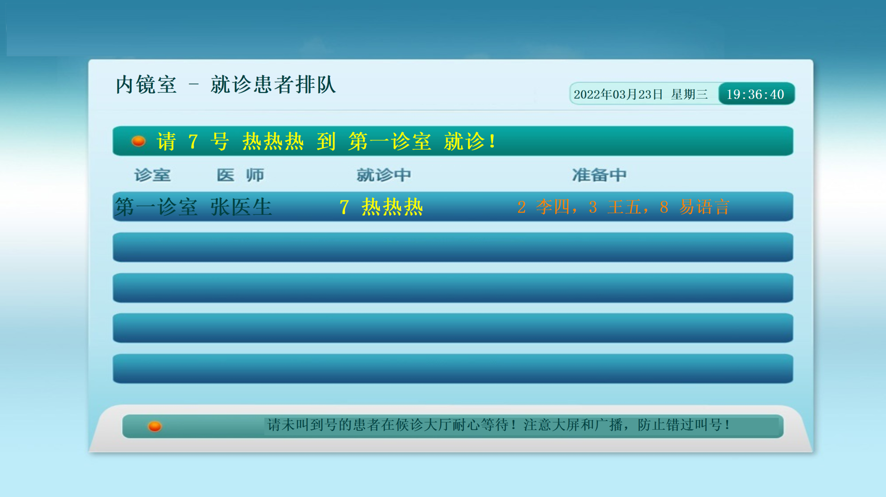

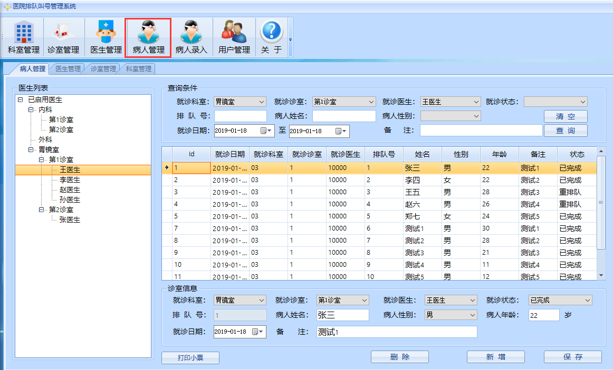

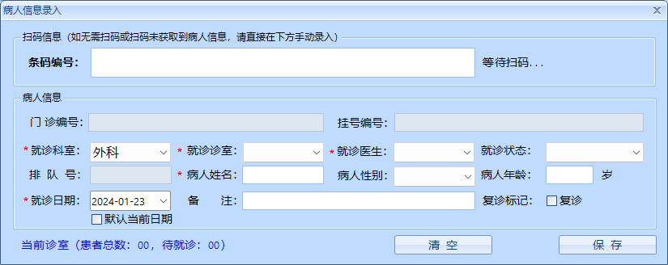

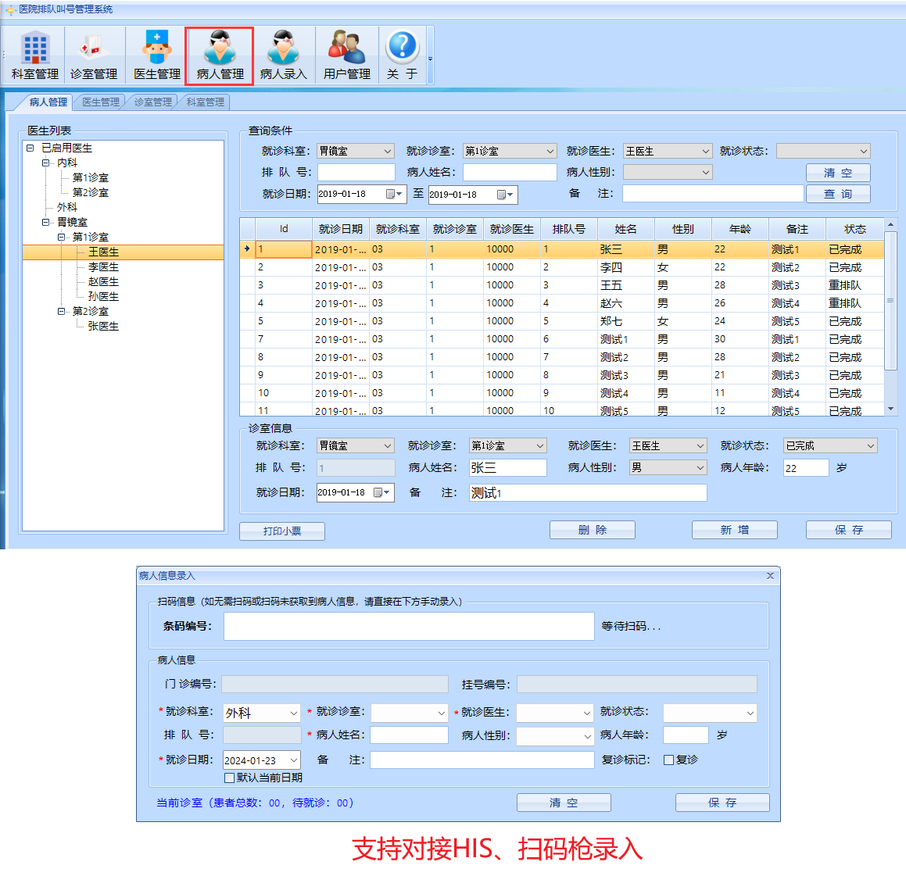

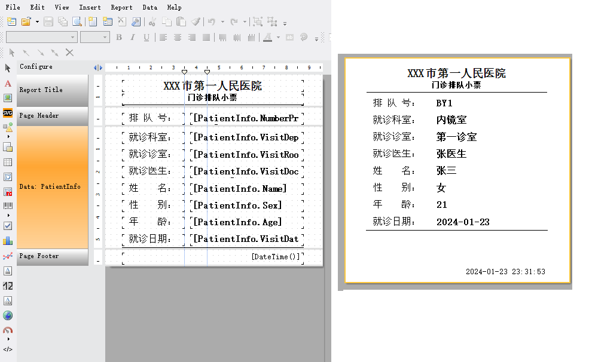

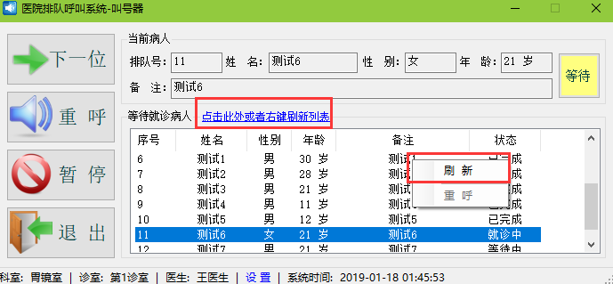

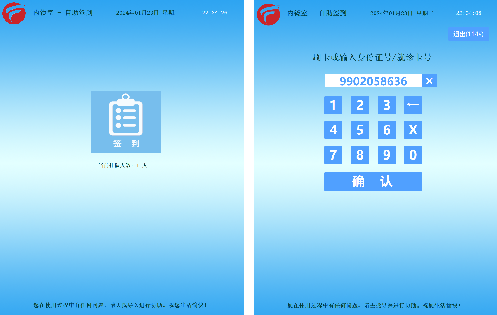

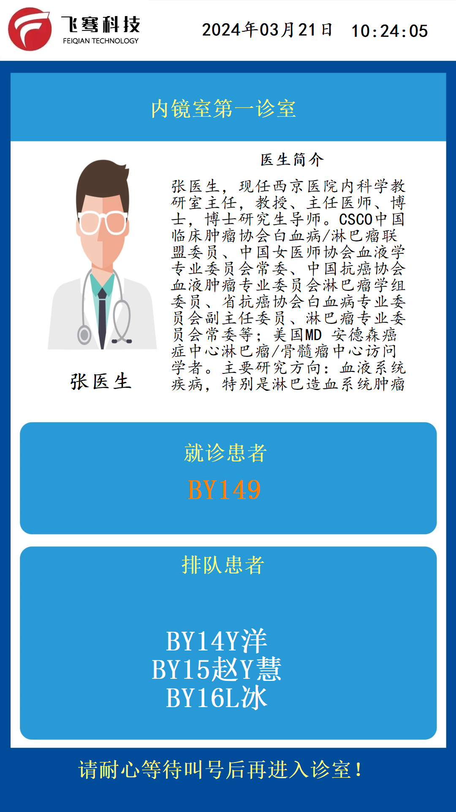

#### 定制开发或授权等商务合作

